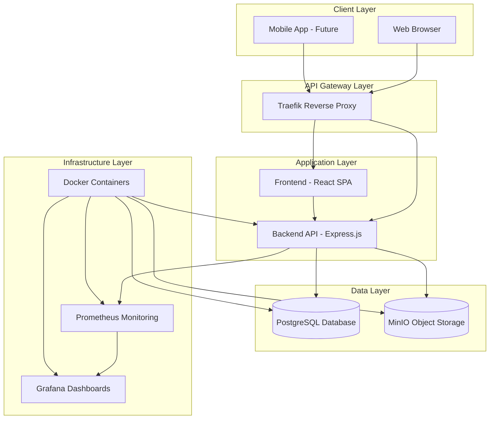
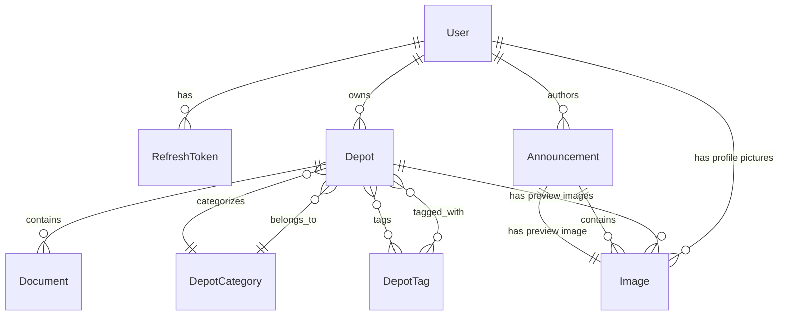

# Griote Platform Architecture

## System Overview

Griote Platform is an open-source platform designed to centralize African knowledge and build GrioteAI, an artificial intelligence designed by and for Africa. The platform collects, structures, and preserves academic works, traditional knowledge, code, datasets, and research produced in Africa, serving as the primary data foundation for GrioteAI.

### Key Features
- **User Management**: Account creation, authentication, and profile management
- **Content Management**: Announcements, depots (repositories), documents, and categories
- **Admin Panel**: User moderation, content management, and system administration
- **File Storage**: S3-compatible object storage for documents and images
- **Monitoring**: Comprehensive monitoring with Prometheus and Grafana

## Technology Stack

### Backend
- **Runtime**: Node.js with Express.js framework
- **Database**: PostgreSQL with Sequelize ORM
- **Authentication**: JWT tokens with refresh token mechanism
- **File Storage**: MinIO (S3-compatible object storage)
- **Validation**: Joi schema validation
- **Email**: Nodemailer for notifications
- **Monitoring**: Prometheus metrics with Winston logging
- **Testing**: Jest with Supertest for integration tests

### Frontend
- **Framework**: React 19 with TypeScript
- **Build Tool**: Vite
- **Routing**: React Router DOM
- **State Management**: TanStack Query (React Query)
- **UI Components**: Radix UI primitives with Tailwind CSS
- **HTTP Client**: Axios
- **Rich Text Editor**: React Quill

### Infrastructure
- **Containerization**: Docker with Docker Compose
- **Reverse Proxy**: Traefik
- **Monitoring**: Prometheus + Grafana stack
- **SSL/TLS**: Let's Encrypt certificates

## System Architecture



## API Architecture

The backend follows a layered architecture pattern:

### Controllers Layer
Handles HTTP requests and responses, delegates business logic to services.

**Key Controllers:**
- `auth.controller.js` - Authentication endpoints
- `user.controller.js` - User management
- `announcement.controller.js` - Content announcements
- `depot.controller.js` - Repository management
- `category.controller.js` - Category management
- `tag.controller.js` - Tag management
- `document.controller.js` - File management
- `stats.controller.js` - Analytics and statistics

### Services Layer
Contains business logic, data processing, and external integrations.

**Key Services:**
- `auth.service.js` - JWT token management, password hashing
- `user.service.js` - User CRUD operations
- `announcement.service.js` - Content management
- `mail.service.js` - Email notifications
- `minio.service.js` - File storage operations

### Middleware Layer
Cross-cutting concerns like authentication, validation, and error handling.

**Key Middleware:**
- `auth.middleware.js` - JWT verification
- `role.middleware.js` - Role-based access control
- `upload.middleware.js` - File upload handling

### DTOs Layer
Data Transfer Objects for request/response validation and serialization.

## Database Architecture

The system uses PostgreSQL with Sequelize ORM following these design principles:

### Database Design Patterns
- **Polymorphic Associations**: Images table supports multiple parent types (users, announcements, depots)
- **Soft Deletes**: Not implemented but prepared for future use
- **Audit Trail**: Created/updated timestamps on all tables
- **Indexing**: Optimized indexes on foreign keys and frequently queried fields

### Database Schema Overview



## Deployment Architecture

The platform uses containerized deployment with Docker Compose:

### Production Services
- **Traefik**: Reverse proxy and load balancer with automatic SSL
- **PostgreSQL**: Primary database with persistent volumes
- **MinIO**: Object storage for files and images
- **Backend**: Node.js API server
- **Frontend**: React SPA served by Nginx
- **Prometheus**: Metrics collection
- **Grafana**: Monitoring dashboards

### Networking
- All services communicate through `griote_network`
- External access through Traefik on ports 80/443
- Internal service discovery via Docker networks

### Volumes
- `postgres_data`: Database persistence
- `minio_data`: File storage persistence
- `grafana_data`: Dashboard configurations

## Security Architecture

### Authentication & Authorization
- **JWT Tokens**: Stateless authentication with access and refresh tokens
- **Password Security**: bcrypt hashing with salt rounds
- **Role-Based Access**: USER and ADMIN roles with middleware enforcement
- **Email Verification**: Account activation via email tokens

### Data Protection
- **Input Validation**: Joi schemas for all API inputs
- **SQL Injection Prevention**: Sequelize parameterized queries
- **XSS Protection**: Input sanitization and React's built-in protections
- **CORS**: Configured for allowed origins

### Infrastructure Security
- **SSL/TLS**: Automatic certificates via Let's Encrypt
- **Container Security**: Non-root users in Docker containers
- **Network Isolation**: Services communicate through defined networks
- **Environment Variables**: Sensitive data stored in env files

## Monitoring and Observability

### Metrics Collection
- **Prometheus**: Scrapes metrics from backend service
- **Custom Metrics**: Application-specific business metrics
- **Infrastructure Metrics**: Container and system monitoring

### Logging
- **Winston Logger**: Structured logging with multiple transports
- **Loki Integration**: Log aggregation and querying
- **Log Levels**: ERROR, WARN, INFO, DEBUG with appropriate filtering

### Dashboards
- **Grafana**: Pre-configured dashboards for:
  - Application performance
  - Database metrics
  - System resources
  - Error tracking

## Project Structure

The project is organized into frontend and backend directories, with additional configuration and documentation files at the root.

```
griote-platform/
├── docker-compose.yml
├── LICENSE
├── README.md
├── .github/
├── .vscode/
├── backend/
│   ├── Dockerfile
│   ├── package.json
│   ├── compose.yaml
│   ├── compose.test.yaml
│   ├── prometheus.yml
│   ├── grafana/
│   │   ├── dashboards/
│   │   └── provisioning/
│   ├── src/
│   │   ├── app.js
│   │   ├── server.js
│   │   ├── config/
│   │   ├── controllers/
│   │   ├── models/
│   │   ├── routes/
│   │   ├── services/
│   │   ├── middleware/
│   │   ├── dtos/
│   │   ├── utils/
│   │   └── docs/
│   └── tests/
│       ├── unit/
│       ├── integration/
│       ├── fixtures/
│       └── setup/
├── docs/
│   ├── ARCHITECTURE.md
│   ├── CODE_OF_CONDUCT.md
│   ├── CONTRIBUTING.md
│   └── SETUP.md
└── frontend/
    ├── Dockerfile
    ├── package.json
    ├── index.html
    ├── vite.config.ts
    ├── nginx.conf
    ├── public/
    └── src/
        ├── main.tsx
        ├── App.tsx
        ├── assets/
        ├── components/
        ├── pages/
        ├── routes/
        ├── services/
        ├── auth/
        ├── hooks/
        ├── lib/
        ├── types/
        └── utils/
```

## Data Models

The backend uses Sequelize ORM with the following models:

### User
- **Table**: users
- **Fields**:
  - user_id (INTEGER, PRIMARY KEY, AUTO_INCREMENT)
  - first_name (STRING, NOT NULL)
  - last_name (STRING, NOT NULL)
  - email (STRING, NOT NULL, UNIQUE)
  - password_hash (STRING, NOT NULL)
  - role (ENUM: 'USER', 'ADMIN', DEFAULT: 'USER')
  - is_email_verified (BOOLEAN, DEFAULT: false)
  - bio (TEXT, NULLABLE)
  - date_of_birth (DATEONLY, NULLABLE)
  - linkedin_url (STRING, NULLABLE)
  - github_url (STRING, NULLABLE)
  - website_url (STRING, NULLABLE)
  - created_at (TIMESTAMP)
  - updated_at (TIMESTAMP)
- **Relationships**:
  - Has many RefreshTokens (foreignKey: user_id)
  - Has many Depots (foreignKey: owner_id)
  - Has many Images (polymorphic, imageable_type: 'user', as: 'images')
  - Has one Image (polymorphic, imageable_type: 'user', as: 'profilePicture', most recent)
  - Has many Announcements (foreignKey: author_id)

### RefreshToken
- **Table**: refresh_tokens
- **Fields**:
  - token_id (INTEGER, PRIMARY KEY, AUTO_INCREMENT)
  - token (STRING, NOT NULL, UNIQUE)
  - user_id (INTEGER, NOT NULL)
  - expires_at (DATE, NOT NULL)
  - created_at (TIMESTAMP)
  - updated_at (TIMESTAMP)
- **Relationships**:
  - Belongs to User (foreignKey: user_id)

### Depot
- **Table**: depots
- **Fields**:
  - depot_id (INTEGER, PRIMARY KEY, AUTO_INCREMENT)
  - owner_id (INTEGER, NOT NULL)
  - category_id (INTEGER, NOT NULL)
  - title (STRING(255), NOT NULL)
  - description (TEXT)
  - status (ENUM: 'DRAFT', 'PENDING', 'APPROVED', 'REJECTED', DEFAULT: 'DRAFT')
  - created_at (TIMESTAMP)
  - updated_at (TIMESTAMP)
- **Relationships**:
  - Belongs to User (foreignKey: owner_id)
  - Belongs to DepotCategory (foreignKey: category_id)
  - Has many Documents (foreignKey: depot_id)
  - Belongs to many DepotTags (through: depot_tag_mappings)
  - Has one Image (polymorphic, imageable_type: 'depot', as: 'previewImage', most recent)

### DepotCategory
- **Table**: depot_categories
- **Fields**:
  - category_id (INTEGER, PRIMARY KEY, AUTO_INCREMENT)
  - name (STRING(100), NOT NULL, UNIQUE)
  - description (TEXT)
  - created_at (TIMESTAMP)
  - updated_at (TIMESTAMP)
- **Relationships**:
  - Has many Depots (foreignKey: category_id)

### DepotTag
- **Table**: depot_tags
- **Fields**:
  - tag_id (INTEGER, PRIMARY KEY, AUTO_INCREMENT)
  - name (STRING(50), NOT NULL, UNIQUE)
- **Relationships**:
  - Belongs to many Depots (through: depot_tag_mappings)

### Document
- **Table**: documents
- **Fields**:
  - document_id (INTEGER, PRIMARY KEY, AUTO_INCREMENT)
  - depot_id (INTEGER, NOT NULL)
  - owner_id (INTEGER, NOT NULL)
  - filename (STRING(255), NOT NULL)
  - url (STRING(512), NOT NULL)
  - file_type (STRING(50), NULLABLE)
  - file_size (BIGINT, NULLABLE)
  - created_at (TIMESTAMP)
  - updated_at (TIMESTAMP)
- **Relationships**:
  - Belongs to Depot (foreignKey: depot_id)

### Announcement
- **Table**: announcements
- **Fields**:
  - announcement_id (INTEGER, PRIMARY KEY, AUTO_INCREMENT)
  - author_id (INTEGER, NOT NULL)
  - titre (STRING, NOT NULL)
  - contenu (TEXT, NOT NULL)
  - statut (ENUM: 'pending', 'published', 'archived', DEFAULT: 'pending')
  - date_creation (DATE, DEFAULT: NOW)
  - date_publication (DATE, NULLABLE)
  - image_apercu_id (INTEGER, NULLABLE)
- **Relationships**:
  - Belongs to User (foreignKey: author_id, as: 'author')
  - Has many Images (polymorphic, imageable_type: 'announcement', as: 'images')
  - Belongs to Image (foreignKey: image_apercu_id, as: 'previewImage')

### Image
- **Table**: images
- **Fields**:
  - image_id (INTEGER, PRIMARY KEY, AUTO_INCREMENT)
  - url (STRING, NOT NULL)
  - description (STRING, NULLABLE)
  - imageable_type (ENUM: 'announcement', 'user', 'depot', NOT NULL)
  - imageable_id (INTEGER, NULLABLE)
  - created_at (TIMESTAMP)
  - updated_at (TIMESTAMP)
- **Relationships**:
  - Polymorphic: Belongs to Announcement, User, or Depot (based on imageable_type and imageable_id)
